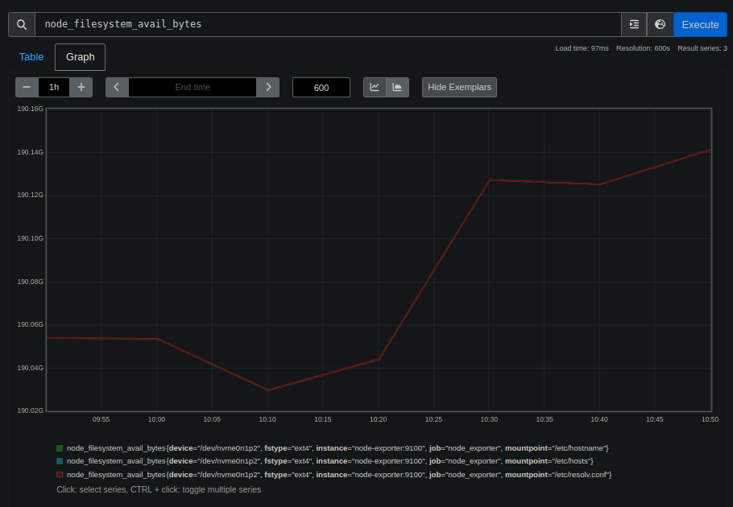
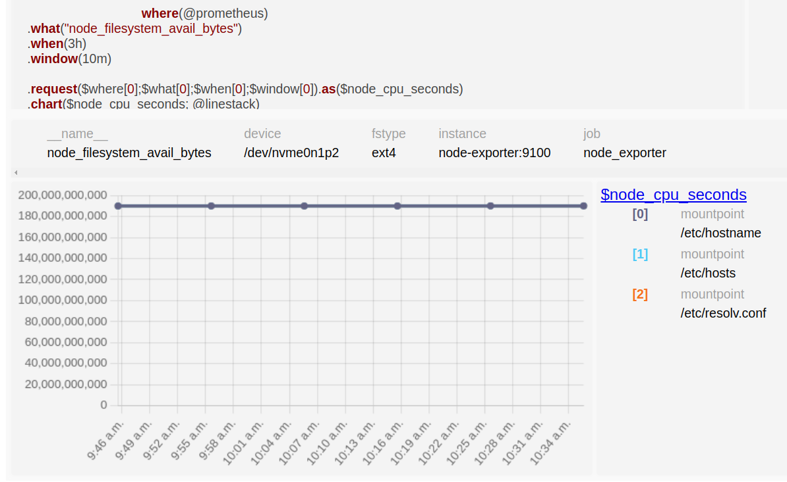
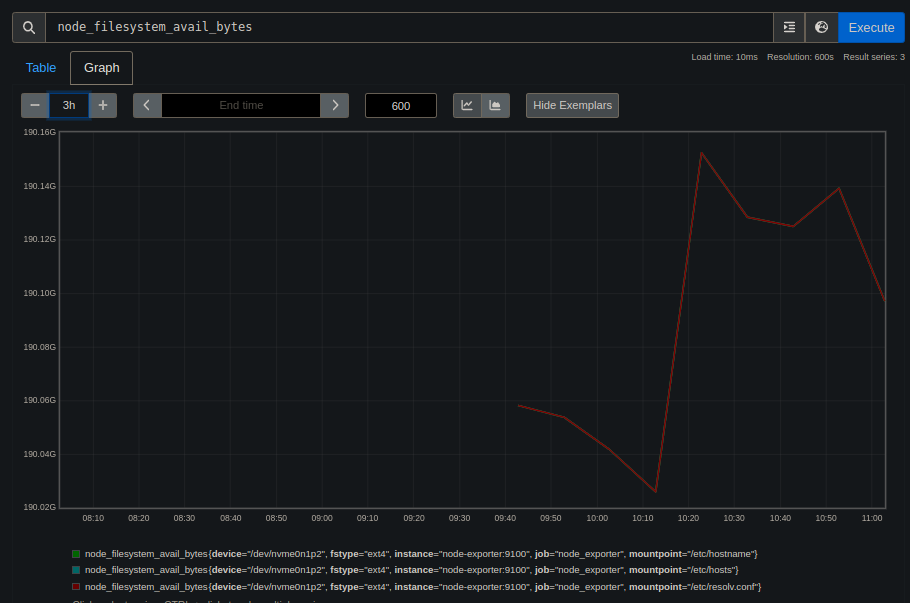
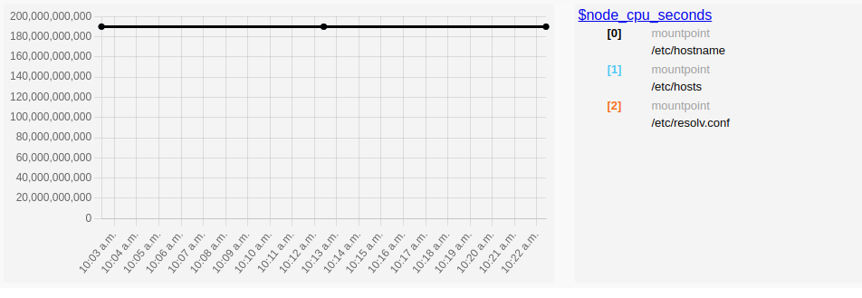
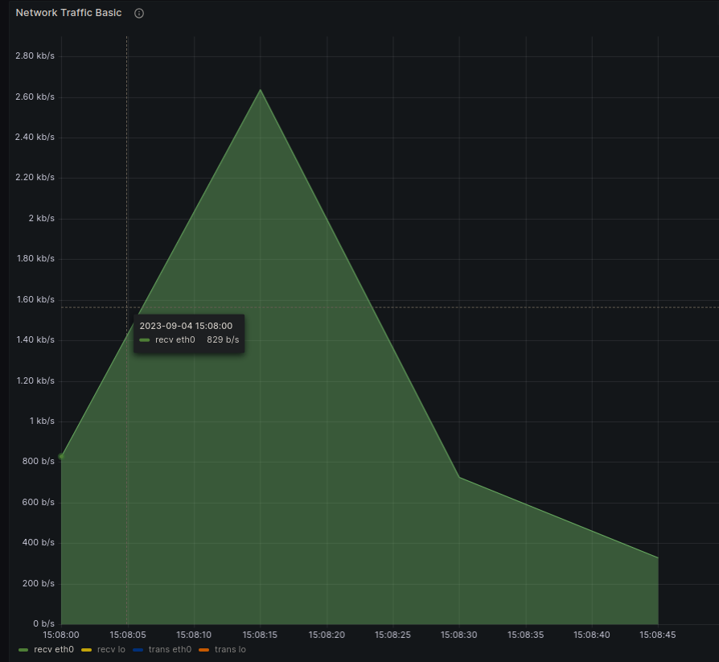
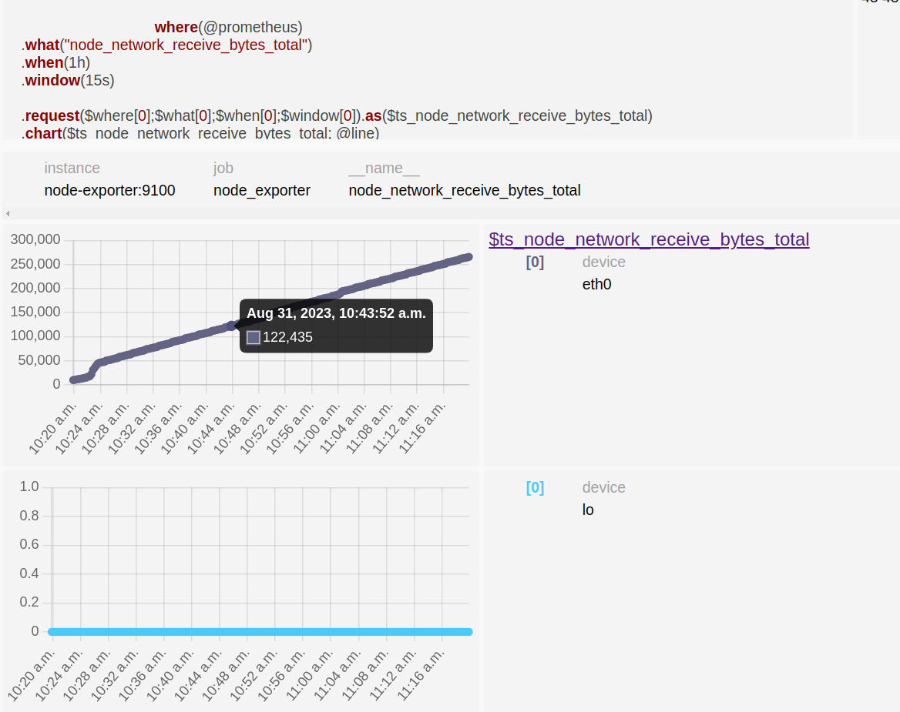
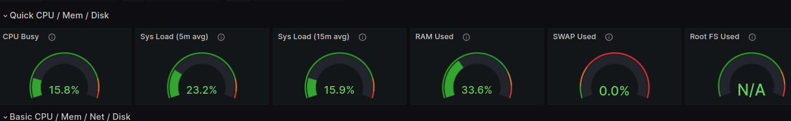

# Annotations

## General 
- Both don't have a way to establish X/Y labels and units. 
- Cannot modify the size of the graphs (whole window). 
- I would like to be able to adjust the size and the colour of the line, in the graph.  

## Prometheus QL
Have nice documentation general speaking. 

### Advantages

- Easier to take subwindows from a bigger one, interactive. 
- In presentation layer a usefull feature migth be use of local time


## PQL prom datasource 

### Advantages

- Have a lot of examples in the repository, which accelerates the process of learning the query language


## Graphics

### `node_filesystem_avai_bytes.pql` : The filesystem space available to non-root users (in bytes)

- The default scale is from 0 in PQL linestack. If the changes in the metrics are not to much it is difficult to appreciate it. It it nice to have the fact to adjust the range of the scale of Y axis.  

prom ql             |  PQL
:-------------------------:|:-------------------------:
  |  

- If the time series is empty by default pql won't show you the empty array in the grapichs. However Prom QL does it. 



- With this configs i did not get the rigth backgroundColor and borderColor

```
    {
      "name": "line",
          "type": "line",
      "vars": {
          "backgroundColor": "rgb(0, 0, 0)",
          "borderColor": "rgb(0, 0, 0)",
          "stacked": true
      }
    }
```

```
    {
      "name": "line",
      "type": "line",
      "vars": {
          "backgroundColor": "#000000",
          "borderColor": "#000000",
          "stacked": true
      }
    }
```




### `node_network_receive_bytes_total.pql` : bytes that device recibes


It might be usefull to develop diff function to evaluate the rate of change of network metrics. Here is an example of the metric that is obtained using grafana:




In this case the informatition is not easy to understand. It might be good to somehow have the posibility to improve the presentation layer to have a better understanding of the metrics that we are displaying, in this case the window is to small and doesn't has to much sense, but there will be cases that it does and so it will be nice to have the ability to zoom in/out easily, adjust the wide of the plot. 




### CPU Busy


- Include guage type in the presensation layer. 

Here are some examples guage's graphs that grafana offers. 




### System LOAD


